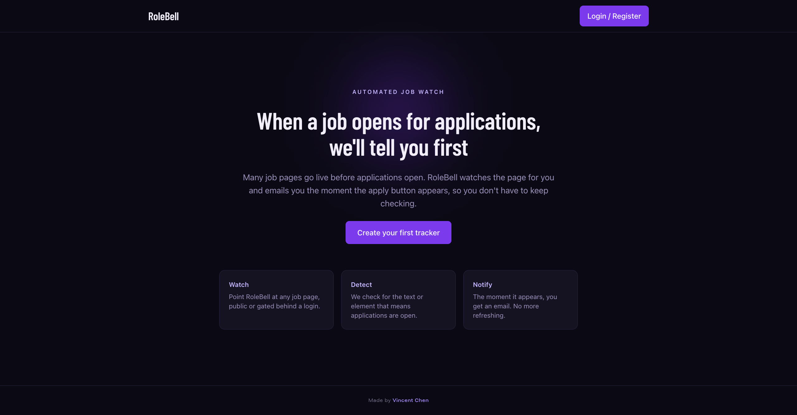
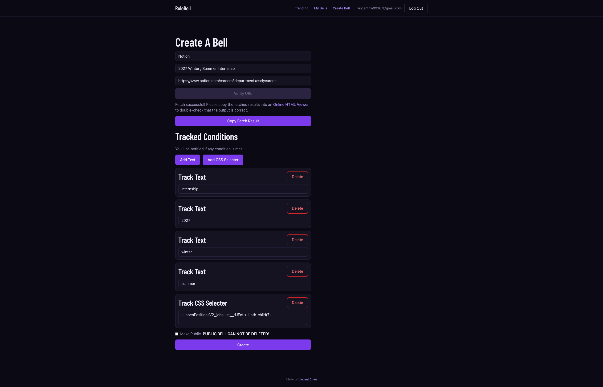
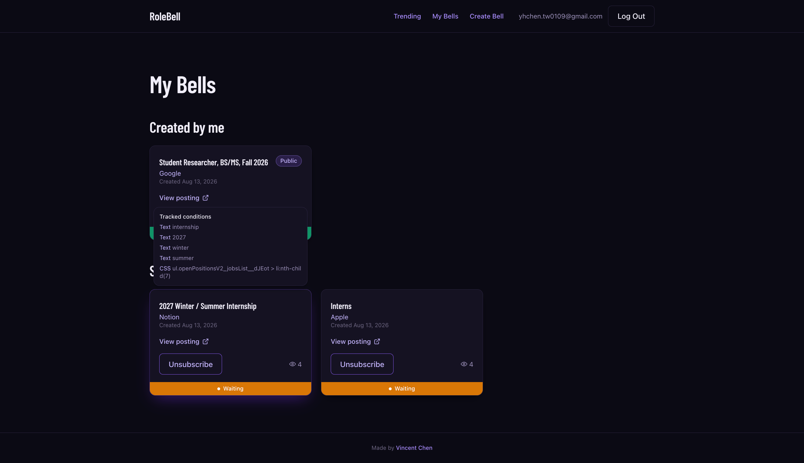
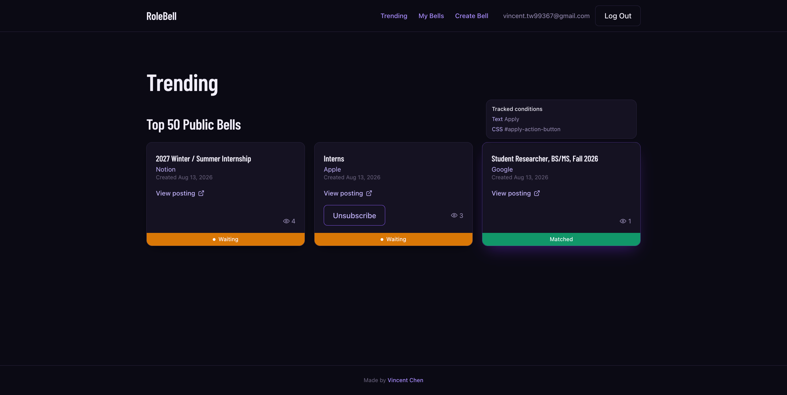
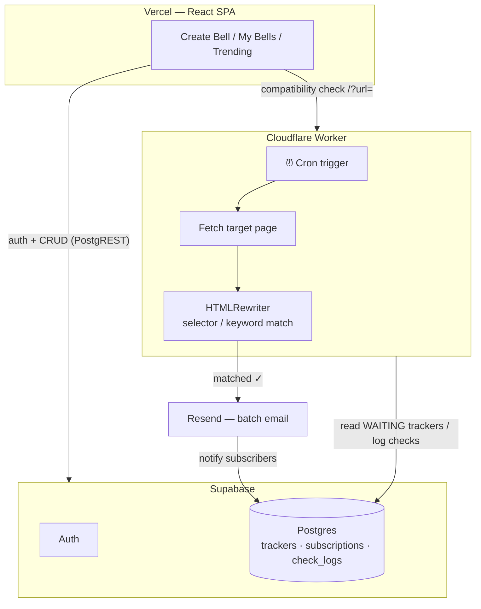

# 🔔 RoleBell

> **Stop refreshing. Start getting notified.**
> RoleBell watches job posting pages for you and sends an email the moment the *Apply* button goes live.


---

## 💡 Why RoleBell Exists

Companies often publish a job posting **before applications actually open** — the page is live, but the *Apply* button isn't there yet, and there's no "notify me" option. If you want that role, your only choice is to keep coming back and refreshing the page. Day after day. Until you either waste hours or simply forget — and miss the window entirely.

RoleBell automates that loop:

1. You point it at the job page you're waiting on.
2. It learns what to look for — a CSS selector or keyword that appears on *already-open* postings from the same site (e.g. the apply button element), but is missing from your target page.
3. A scheduler re-checks the page on a fixed interval. The moment the element/keyword appears, you get an email — first, not eventually.

And because many people usually wait on the same posting, every tracker can be **shared**: other users subscribe to an existing tracker in one click instead of configuring their own.

## ✨ Features

| | Feature | Description |
|---|---|---|
| 🔔 | **Create a Bell** | Paste a job page URL, define match conditions (CSS selectors and/or keywords), and save the tracker. A compatibility check verifies the page can be fetched and parsed before saving, and an inline **?** popover documents exactly which CSS selectors the matcher (HTMLRewriter) supports. |
| 👀 | **Condition preview** | Hover any bell card to see its tracked conditions — every keyword and CSS selector — without opening anything. |
| ⏱️ | **Scheduled detection** | A Cloudflare Worker cron sweeps all `WAITING` trackers, fetches each page, and evaluates the match conditions. Every check is logged with its HTTP status and result. |
| 📧 | **Email notifications** | On a match, all subscribers get a notification email (batched through Resend) and the tracker is marked complete — no duplicate alerts. |
| 🌐 | **Community sharing** | Trackers can be public. Anyone can subscribe to an existing tracker without re-configuring the URL and conditions. |
| 🔥 | **Trending** | A ranked view of the most-subscribed public trackers, so you can discover which openings people are watching right now. |

## 📸 Screenshots

| | |
|---|---|
|  |  |
| *Landing — automated job watch* | *Create a Bell — conditions with selector-rules help* |
|  |  |
| *My Bells — hover a card to preview its conditions* | *Trending — top public bells, subscribe in one click* |

## 🏗️ Architecture



**Detection flow**

```
[User submits URL] → [Worker compatibility check] ──(unparsable)──> "Dynamic page not supported yet"
        ↓ (pass)
[Tracker saved to Supabase, status = WAITING]
        ↓
[Cloudflare Cron trigger] → [fetch page HTML] → [HTMLRewriter: CSS selector / keyword match]
        ↓ (match found)
[status → MATCHED] → [Resend batch email to all subscribers] → [subscriptions marked notified]
```

## 🧠 Tech Decisions

The original plan included a real backend server — the only way to run a headless browser and support pages that render their content with client-side JavaScript. But keeping a server (or a browser-rendering service) alive just for that would have dominated the project's cost. Re-evaluating the actual targets showed most job postings serve their content as plain HTML, so I deliberately **cut dynamic-page support from scope**: cover the majority of sites with a simple HTTP fetch, reject the rest at creation time with a clear "not supported yet" message.

That one trade-off collapsed the architecture. With no browser to run, the "backend" is just CRUD plus a periodic fetch-and-compare job — which means **no server at all**, and every piece could be chosen to run serverless on generous free tiers.

| Choice | Instead of | Why |
|---|---|---|
| **Cloudflare Workers** (cron + fetch) | A hosted Node server / Vercel cron | Native [cron triggers](https://developers.cloudflare.com/workers/configuration/cron-triggers/) and 100k free requests/day — polling many pages on a tight interval fits comfortably. Bonus: the built-in **`HTMLRewriter`** does streaming CSS-selector matching at the edge, replacing an Axios + Cheerio dependency stack with zero libraries. |
| **Supabase** | Self-managed PostgreSQL + Prisma + custom auth | One service covers Postgres, row-level-secured REST (PostgREST), and email/password auth with verification. The frontend talks to it directly with the anon key; the Worker uses the service-role key — no API layer to build or host. |
| **Resend** | AWS SES | Minutes to set up, clean batch-send API (one HTTP call notifies every subscriber of a tracker), and a free tier that covers this scale. SES is cheaper at volume but heavier to configure — the wrong trade-off for an MVP. |
| **Vercel** | — | Zero-config hosting for a Vite SPA with a one-line rewrite for client-side routing. |
| **Vite + React + Tailwind** | — | Fast dev loop, file-based routing via `vite-plugin-pages`, utility-first styling. |

## 📁 Project Structure

```
role_bell/
├── src/                     # React SPA (Vercel)
│   ├── pages/               # File-based routes
│   │   ├── create_bell/     #   Configure a new tracker
│   │   ├── my_bells/        #   Your trackers & subscriptions
│   │   ├── trending/        #   Most-subscribed public trackers
│   │   └── login|register|verify/
│   ├── components/          # Layout, Navbar, TrackerCard, RequireAuth
│   └── utils/               # Supabase client, auth context
└── worker/                  # Cloudflare Worker
    └── src/index.ts         # Cron sweep, HTMLRewriter matching,
                             # Resend notifications, check logging
```

## 🚀 Getting Started

### Frontend

```bash
npm install
npm run dev
```

Create `.env.local`:

```bash
VITE_SUPABASE_URL=https://<project>.supabase.co
VITE_SUPABASE_ANON_KEY=<anon-key>
```

### Worker

```bash
cd worker
npm install
npx wrangler secret put SUPABASE_SERVICE_ROLE_KEY
npx wrangler secret put RESEND_API_KEY
npm run dev      # local
npm run deploy   # deploy with cron trigger
```

`SUPABASE_URL` and `RESEND_FROM_EMAIL` are set in [worker/wrangler.jsonc](worker/wrangler.jsonc).

## 🗺️ Roadmap

- [ ] Support JavaScript-rendered (dynamic) pages
- [ ] Per-tracker check intervals
- [ ] More notification channels (Telegram / Discord / LINE)

---

<p align="center">Built by <a href="https://github.com/Eggy99367">Vincent Chen</a> · Because the best time to apply is the minute it opens.</p>
